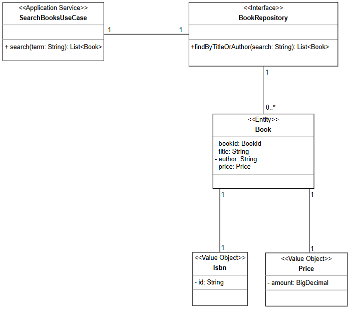

# Book Purchasing System - Web Application Project
This project aims to develop a web application that addresses microservices architecture, expanding knowledge and practical experience in the fields of the software development cycle, frameworks, programming, testing and deployment.

- [General info](#general-info)
- [Technologies Used](#technologies-used)
- [Project Management](#project-management)
- [Domain-Driven Design (DDD) & Architecture](#domain-driven-design-ddd--architecture)
- [Incremental Development Lifecycle](#incremental-development-lifecycle)
- [Project Status](#project-status)
- [Inspiration](#inspiration--references)

## General info
The project is an application that addresses the idea of microservices, which describes components of a system that are independent or "loosely coupled". Each component has a defined responsibility and the resources it needs to function. For the development of the application's microservices, Spring Boot, MySQL for database management, the Postman tool for building HTTP requests and React/Next for the user interface are currently being used.

## Technologies Used
* Backend: Java, Spring Boot, MySQL, REST API
* Frontend: React / Next.js
* Version Control: Git + GitHub

## Project Management

I manage the development of this project using **GitHub Projects** (Scrum style):

[View Project Board](https://github.com/users/iandersonalmeida/projects/16)

## Domain-Driven Design (DDD) & Architecture
This project embraces an **evolutionary and incremental architecture** driven by Domain-Driven Design (DDD). Instead of defining a massive, rigid microservices structure upfront, the architecture emerges  as each **Bounded Context** is independently explored and developed.

Currently, the system is focused on isolating and perfecting a single subdomain.

### Bounded Context: Catalog
Following DDD's tactical design patterns, I have the following patterns: Entities, Value Objects, Aggregates, Repositories, and Domain Services. Applying these patterns, I have that elementary domain model:

* **Catalog Domain Model (UML):**  
  

* Within the Catalog Context, I have the concept of a Book as the domain object. This domain object must have a unique identity over time, even if there are changes in its state, as well as type safety; therefore I treat this object as an Entity.
* The unique identity of the Book entity ensures that one book can be distinguished from another. To avoid problems when the identity is used elsewhere, I define the identity as an ISBN Value Object. Since Title and Author are currently just attributes to assist in book searches within this context, we can leave them as strings.
* I also define Price as a Value Object to ensure that this object will always have a valid state and remain immutable.
* Since the service does not encapsulate any business rules involving other domain concepts, it was defined as an Application Service.
* To assist the Application Service, I apply the Repository pattern to model a conceptual container of books.

## Incremental Development Lifecycle

The application is built **incrementally, feature by feature, using vertical slicing**. For each development stage, the implementation flows naturally from the **Backend** (core business rules, database, and APIs) to the **Frontend** (UI construction and API consumption).

### Stage 1: Catalog Context (Current Stage)
Focuses on delivering the complete vertical slice of the catalog functionality based on the new DDD model.

#### Backend Development
In this project, the backend is developed under the **Microservices Architecture** pattern, where each service is built as a completely autonomous, loosely coupled, and self-contained component focused on a single business capability. 

The Catalog backend is the first functional microservice implemented. To avoid architectural degradation and ensure that this service remains healthy and maintainable, its internal codebase is structured to isolate the core business rules from framework-specific details (such as Spring Boot or databases).

##### Microservice Internal Structure
The codebase for the Catalog microservice is organized into four clear, functional boundaries:

* **`domain` :** This is the heart of the microservice, containing framework-free Java code. It holds the entities, aggregates, and value objects (like `Book`, `BookId`, and `Price`), domain services for stateless business logic, and the abstract repository interfaces (contracts) required by the domain.

* **`presentation` :** Responsible for exposing the microservice to the external world. It contains the REST Controllers (e.g., `BookController` using `@RestController`) that receive incoming HTTP traffic, handle request parameters, and map exceptions into clean HTTP responses.

* **`application` :** Acts as a thin coordination layer. It receives requests from the presentation layer, handles Data Transfer Objects (DTOs), uses mappers, and orchestrates the execution of the business logic defined within the domain.

* **`infrastructure` :** Contains all the technical details and framework configurations that allow the microservice to run. This is where Spring Data JPA repositories, database drivers, and cloud configurations reside, fulfilling the data persistence contracts defined by the domain.

By enforcing this structure, the microservice achieves maximum testability—allowing core business rules to be tested with lightning-fast unit tests—and ensures that the service can evolve, scale, or change its database technology without affecting its core business definition.

#### Frontend Development
The frontend adopts a component-driven approach built with **React** and **Next.js**, focused on creating the visual entry point for the system.

* **Main Home Page (Active Core):** The primary landing page (`home`) is currently the only stable, fully implemented environment. It establishes the application's foundational layout, responsive grids, and core visual identity.

* **Scope and Placeholders:** In alignment with our incremental lifecycle, other interactive UI elements—such as search inputs, buttons, and cross-page links—are currently present as architectural *placeholders*. They map out the future user experience but remain non-functional until their respective backend contexts and integrations are developed in future stages.  

  
## Project Status
The project is currently under development.

## Inspiration & References

This project’s architecture, design patterns, and implementation strategies were heavily inspired by the following software engineering books, official documentations, and architectural guides:

### Books
* **Domain-Driven Design: Tackling Complexity in the Heart of Software** – *Eric Evans*
  > Inspired the transition from a generic model to strategic boundaries and tactical patterns like Entities, Value Objects, and Domain Services within the Catalog microservice.
* **Implementing Domain-Driven Design** – *Vaughn Vernon*
  > Provided the practical blueprint for structuring a healthy microservice with isolated, framework-free domain logic.
* **Spring Microservices in Action** – *John Carnell & Illary Huaylupo Sánchez*
  > Guided the conceptual framework for building, deploying, and managing scalable cloud-native microservices with Spring Boot.
* **React in Action** – *Mark Tielens Thomas*
  > Helped shape the mental model for building a dynamic, component-driven UI for the frontend development stages.
* **Microservices Patterns: With examples in Java** – *Chris Richardson*
  > Influenced the architectural decision to decompose the system using DDD subdomains, guiding how independent Java services should be designed and interact.

### Documentation & Architectural Guides
* **Microsoft Azure Architecture Center:**
  * [Domain Analysis for Microservices](https://learn.microsoft.com/en-us/azure/architecture/microservices/model/domain-analysis) – *Conceptual reference for identifying Bounded Context boundaries.*
  * [Tactical DDD for Microservices](https://learn.microsoft.com/en-us/azure/architecture/microservices/model/tactical-domain-driven-design) – *Guidance on applying tactical DDD patterns during microservices design.*
* **Backend Stack:**
  * [Spring Framework Documentation](https://docs.spring.io/spring-framework/reference/)
  * [Spring Boot Documentation](https://docs.spring.io/spring-boot/index.html)
* **Frontend Stack:**
  * [React Documentation](https://react.dev/)
  * [Next.js Documentation](https://nextjs.org/docs)

