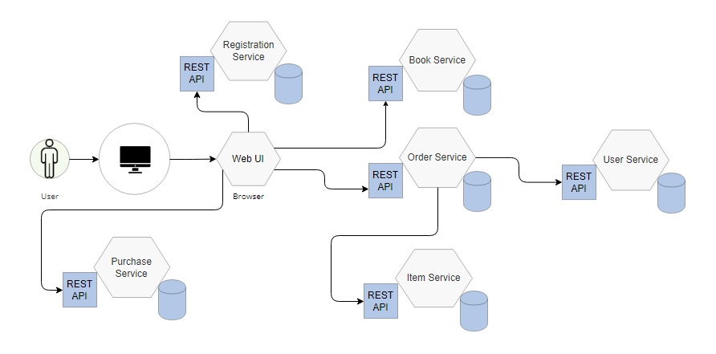
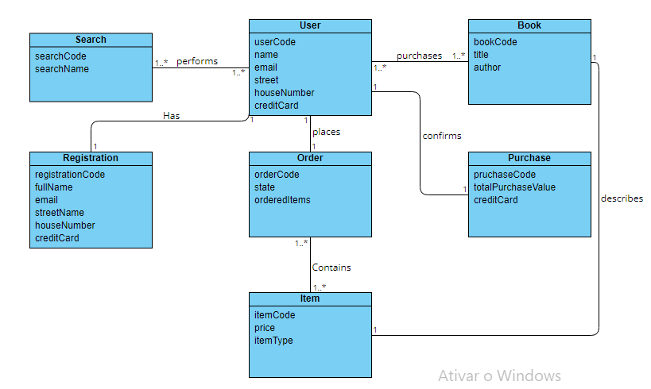
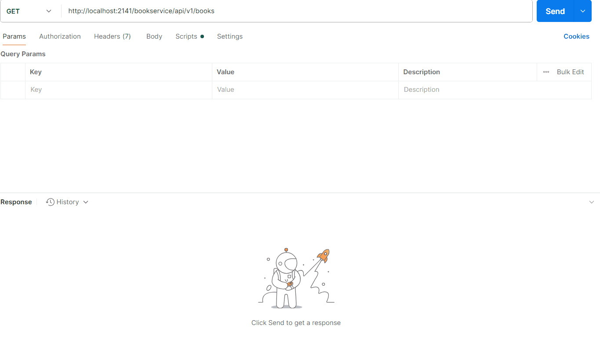
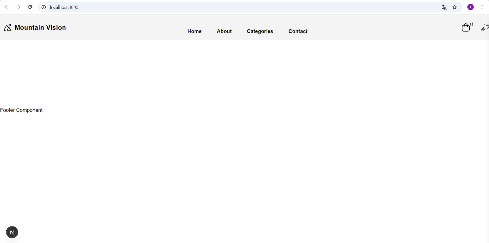

# Book Purchasing System - Web Application Project
This project aims to develop a web application that addresses microservices architecture, expanding knowledge and practical experience in the fields of the software development cycle, frameworks, programming, testing and deployment.

- [General info](#general-info)
- [Technologies Used](#technologies-used)
- [Overall Architecture](#overall-architecture)
- [Application Domain Model](#application-domain-model)
- [Backend Development](#backend-development)
- [Frontend Development](#frontend-development)
- [Project Status](#project-status)
- [Inspiration](#inspiration)

## General info
The project is an application that addresses the idea of microservices, which describes components of a system that are independent or "loosely coupled". Each component has a defined responsibility and the resources it needs to function. For the development of the application's microservices, Spring Boot, MySQL for database management, the Postman tool for building HTTP requests and React/Next for the user interface are currently being used.

## Technologies Used
* Backend: Java, Spring Boot, MySQL, REST API
* Frontend: React / Next.js
* Infrastructure: Docker, Docker Compose
* Version Control: Git + GitHub

## Overall Architecture

## Application Domain Model

## Backend Development
Each microservice is built with Spring Boot and follows a clear separation of concerns.
### API Documentation 
Interactive API documentation is available via Swagger UI. You can explore all endpoints, parameters, request/response examples, and schemas at the link below:
[View Swagger API Documentation](https://iandersonalmeida.github.io/book-purchasing-system/)
### Book Service
* Exposes endpoints to manage books
* Uses Spring Data JPA for database access
* Returns JSON responses through REST API
###  Data Fetching Example
This is a demonstration of a sample API request made using Postman.  
It showcases an example of the communication between a MySQL database and a Spring Boot application that represents the Book Service and how I structure and test HTTP requests, handle headers and parameters, and inspect API responses — a key part of my backend and API testing workflow:

The application uses Spring Data JPA and follows MVC architecture. The response is returned in JSON format.

## Frontend Development
The frontend is being developed using Next.js, a React framework that enables server-side rendering and static site generation.

### Homepage
The frontend has been recently rebuilt to improve design and structure. Below is a representation of the current homepage developed with Next.js:
 

### Demo - Responsive Interface
Here's a quick preview of the application running on different screen sizes:

  
## Project Status
The project is currently under development.

## Inspiration
This application is based on the book: Spring Microservices in Action, and Spring Framework Documentation.

